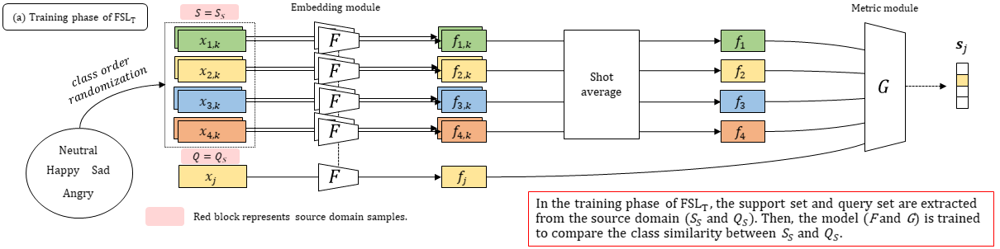

Separate block diagrams for training and test phases for FSLT, FSLS, and FLUDA.

# FSLT
Few-shot Learing with target samples (support set) in the test phase

# pFSL (pseudo-FSL)
Few-shot Learing with source samples (support set) in the test phase

# FLUDA

Few-shot Learning and Unsupervised Domain Adaptation in the training phase 

Few-shot Learing with source samples (support set) in the test phase

